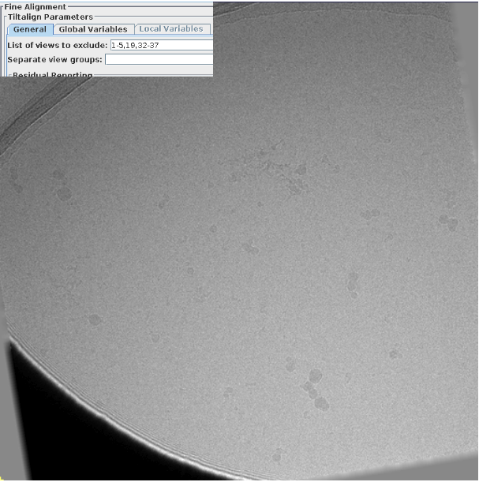
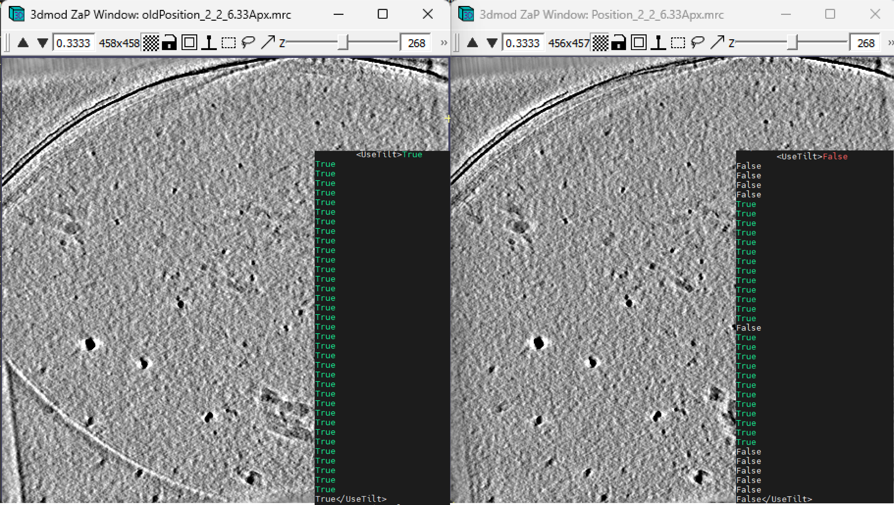

# Removing Skipped Views in etomo from WarpTools

A Python utility for processing XML files in cryo-electron tomography workflows, specifically designed to update `UseTilt` values based on tilt alignment solutions from WARP.

## Overview

This tool processes XML files and updates their `UseTilt` values based on data from corresponding `taSolution.log` files. It's particularly useful for:

- Removing skipped views from tilt series based on etomo alignment logs that are created in fine-alignment step
- Setting specific numbers of views to keep based on dose values, lowest accumulated doses are also the lowest tilts
- Setting all views to True for testing purposes or just going back to default
- Batch processing multiple XML files with automatic backups

This is needed when there are views that need to be excluded from the tomogram:


*Figure: Example of the view that need to be skipped.*

By turning the UseTilt to False for that view, the shadow goes away:



*Figure: Result after removing skipped views using this code, the UseTilt section of the xml file is also shown.*


## Features

- **Automatic backup creation** - Safely backs up original XML files before modification, the backup directory needs to be new to avoid overriding original backups
- **etomo-based filtering** - Uses `taSolution.log` files to determine which views to keep
- **Dose-based selection** - Option to keep only the N lowest-dose views
- **Tilt-based selection** - Option to keep only until a certain amount of tilt from the first view
- **Batch processing** - Process multiple XML files with customizable patterns
- **Safety first** - Never overwrites existing backups

## Installation

### Prerequisites

- Python 3.6+
- Required Python packages:

```bash
pip install pandas click lxml
```

### Setup

```bash
git clone https://github.com/yourusername/warp_remove_skipped_views.git
cd warp_remove_skipped_views
pip install pandas click lxml
```

## Usage

### Basic Commands

```bash

# Process with custom pattern and directories, this would work in the warp_tiltseries directory in the default WarpTools structure
python remove_skipped_view.py --xml-dir ./ --xml-pattern "*.xml" --backup-dir backup_xml --tiltstack-dir tiltstack

# Set all UseTilt values to True
python remove_skipped_view.py  --xml-dir ./ --xml-pattern "*.xml" --backup-dir backup_xml --all-true

# Keep only 20 lowest-dose tilts
python remove_skipped_view.py --xml-dir ./ --xml-pattern "*.xml" --backup-dir backup_xml --n-tilts 20
```

### Command Line Options

| Option | Default | Description |
|--------|---------|-------------|
| `--xml-dir` | `./` | Directory containing XML files to process |
| `--xml-pattern` | `*.xml` | Glob pattern to match XML files |
| `--backup-dir` | `backup_xml` | Directory to store XML backups |
| `--tiltstack-dir` | `tiltstack` | Base directory containing tiltstack logs |
| `--all-true` | False | Set all UseTilt values to True (ignores log files) |
| `--n-tilts` | 0 | Keep N lowest-dose views, set others to False |
| `--max-tilt`| 0 | Keep views up to this tilt from the lowest tilt

## Processing Modes

### 1. Log-based Filtering (Default)
When `--n-tilts 0` (default):
- Views present in `taSolution.log` → `UseTilt = True`
- Views not in log → `UseTilt = False`

### 2. Dose-based Selection
When `--n-tilts > 0`:
- Sorts tilts by dose values from XML
- Sets the N lowest-dose tilts to `True`
- Sets remaining tilts to `False`
- **Note**: Views not in taSolution.log are always set to `False`

### 3. Dose-based Selection
When `--n-tilts > 0`:
- Sorts tilts by dose values from XML
- Sets the N lowest-dose tilts to `True`
- Sets remaining tilts to `False`
- **Note**: Views not in taSolution.log are always set to `False`


### 4. All True Mode
When `--all-true`:
- Sets all `UseTilt` values to `True`
- Useful for testing or resetting configurations

## Expected Directory Structure


```
warp_tiltseries/
├── *.xml                          # XML files to process
├── backup_xml/                    # Backup directory (auto-created)
└── tiltstack/                     # Tiltstack made by warp
    └── [xml_basename]/
        └── taSolution.log          # each TS done in etomo gets a taSolution.log 
```

## License

This project is released under a permissive open-source license. You are free to use, modify, and distribute it for any purpose. See the LICENSE file for more information.

## Acknowledgments

- Designed for [WARP2.0](https://github.com/warpem/warp) cryo-electron tomography workflows 
- Built with pandas, click, and lxml
- Thanks to Alister Burt and Dimitry Tegunov for the support 